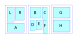
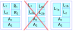

# Complex polyglot layouts
At present, the XeTeX code allows for vertical alignment of multiple columns. 
The column arrangement can (for polyglots) be defined as a series of letters (`L` - originally the Left column. `R` - originally the Right column, and then `A`, `B`, `C` etc.) The  column order is  set as a string, `LRA` for a default triglot, (becoming `ARL` on mirrored pages),  and if the `polyglot-simplepages` is loaded, the column order might be `LR,AB` for a quad-glot over two pages. This string is interpreted by the layout code to presentation determine order and where the different translations are on which pages. Currently, an entirely blank page is specified by `-`. Eventually, this could be extended so that `-` indicates  a page or section with note lines. 

There have been some requests for up/down diglots, where one translation 
is displayed below another.

Two-text up/down diglots are a restricted case of multi-row polyglots which in turn are a
special case of two potential layouts: columns-of-columns polytglots or of rows-of- columns polyglots. 

Columns-of-columns polyglots would provide a 
side-by-side arrangement of several quasi-independent columns.
This does not allow for any columns to be full width (unless all are),  and the question of vertical alignment between chunks in different columns becomes somewhat confused. 

As such, it is assumed that  the more desirable abstraction is that of the rows-of-columns polyglots, 
 such as the `LR/A`layout  (with `/` indicating a new row)  that below (showing a 
double-page spread, with mirroring).  L1 etc are intended to show  vertical  alignment between the L and R chunks on a given row.

")

As a further extension, bracketing is desired, e.g. apparently NET uses an `N(L/NN)N` layout.
Parsing this could be 'simplified' by using a `|` within the brackets. Alternatively a (potentially fully-nesting) parser can be written, taking one character at a time, and indeed it is felt this approach is likely to be more stable against malformed input.

Assuming multiple-brackets are in use, then even a single depth of nested-parsing will provide for rows-of-columns-of-rows-of-columns, which allows for the earlier-dismissed option of columns-of-columns, (e.g. `(L/R)(A/B)`) if someone actually wants that.

Taking the concept of abstraction a step further, rows-of-columns polyglots are, in-turn,  a special case of multipage rows-of-columns. 
Experience gained while developing the polyglot-simplepages layout was
 that the coding effort needed for an N-page layout compared to a 2-page 
 layout is trivial, as long as the design goals are thought-through well. Thus it 
 is deemed more appropriate to develop for the N-page layouts even if the 
 expected use-cases are rare.

Here is an overkill example of that (un-mirrored), showing the layout `LR/A,BC/DEF,G/H`:

While it is expected that single-page layouts will be more popular than 2-page
layouts, and further, such a multi-page layout as shown will never be used in a
formally printed edition, there would still be use-cases for a translation consultant
or pastor who wanted to have, say, greek/hebrew as an interlinear and several national and
international translations available as well as the vernacular text.

## The question of repeated columns
There are 2 potential varieties of multi-page,rows-of-columns layouts: 

**(a)** those in
which a particular text *only* occurs in a single column, *vs*  **(b)** those
where one text is split between several different 'windows' or 'displays'. This
second variety includes where a double-column layout is desired for one or more of the  texts, or,  equally, when it is desired to have an interlinear text across both pages of a 2 page layout, with other translations above/below it.  The NET study-bible layout mentioned above is another example.  

Algorithms for both of these layouts will be considered below. One user has already asked if it would be possible to have one translation being in a 2 column layout at the top of the page, with another 2 translations below it.

That seems possible, but  there are some arrangements that, while seeming plausible, need to be  rapidly rejected out of hand.  It is simply not possible for XeTeX to produce a layout in which 
a single flow of text changes its column width without a *rigid* page layout,  or simulating one with multiple additional runs, as are required for  figures in cutouts.  If each page needed only a single re-run (probably unlikely) the number of job re-runs needed would scale as  O(2N) (N being the page count). 
Theoretically it might be possible for a chunk to be captured as a token list, however this is equally fraught, especially given that macros perform cat-code switching - unwrapping a token list where all cat-codes have already been assigned will never be the same as reading from a file. 

### "Accounting" issues.
The boxes and variables for each displayed column will be needed as at present, and  these will need a 'display identifier' to identify them.
Too much of the existing code assumes that the display identifier is a
**single upper case letter**. Deviating from this would add considerably to the  programming task.  The suggested approach is as follows:

* Use column identifiers as display identifiers for the first column,
encountered (Note this depends on LTR or RTL reading direction). Follow-on columns are 
mapped to otherwise unused upper case letters. E.g. second A (mnemonically A2)  which maps to e.g. U). The mnemonic mapping is
defined as the column definition is read, and to aid debugging, it is unclear if this 
should be a permanent assignment. (e.g. no matter if other layouts are used, A2 is always  U, once defined that way.) 

* If a new page-layout description is given, there are 2 options:
 to discard the intermediate assignments or to leave them as-is. Debugging ease suggests leaving them as-is. The corollary of this is that  the code must disconnect the mapping if less columns are provided in the new mapping.
* A new page-layout description must trigger a page break and output of all pending material, or it might not be printed.

### Multiple chunks and alternative displays with repeated columns
If  a given column is repeated, then the question of responding to a new chunk
becomes very important.  Compare with a layout `LR/A`,  and the page contents
coming as 2 chunks (L1,L2, R1,R2, etc) then (without repeating
columns), the result would be expected to be 
with L2 below L1, and so on, much like with the current diglot code - once
a chunk or chunk-fragment is defined, it is fixed, and either occurs on the
page or it does not (say because it is a section heading and the following
chunk won't fit).
  However, if L1 has been split into 
multiple columns, (L and Z), then duplicating this behaviour will result in 
the reading order being entirely unintuitive:

If the second chunks L2 and A2 were not present in the input (or did not
fit on the page, either due to space available or other factors, such as them
being headings), then the principle of unused space being at the bottom of the
page would say dividing L~1a~ and L~1b~ as in  the crossed-out middle
figure above was correct *in that first chunk*.  If they *are* present, however,  then
L1 must be merged and re-broken (combined notes) or even the galley reprocessed (per-column footnotes).

### Summary for repeated columns
Thus it is necessary that if a column is repeated, then:

1. There is *no* column synchronisation for columns that appear more than 
once in a  npage-set, except (possibly) the end-verse.
2. Consideration on positioning of footnotes may alter how the algorithm behaves. 
3.  The full galley (or processed galley, see efficiency possibilities **E1**, and **E2** below) 
for all split columns must be preserved between chunks, in case a following chunk is added. 
4. The processed column(s) / (page state) must be preserved between chunks and *still be  available* after the new chunk is processed, in case the new chunk does not 
 fit. This is potentially more significant than the current state-reset on a chunk being pulled onto the next page.
5. **E3**  and  **E4** below suggest that *potential* solutions for all columns might need to be saved to reduce the page-rebuilding time.
6. Probably other things I've not thought of yet.
## Common elements for (all forms of) polyglot
There are certain  parts of the algorithms that the processing that stand unchanged, or only need some minor tweaking for the different algorithms.

### Common algorithm for pre-layout portions:

* Read a set of chunks, saving  any discardable spacing after the chunk.
* Determine (based on penalty before end-of-chunk contents) if this chunk is **conditional**  or **unconditional**. (An unconditional chunk can be last item on the page, a *conditional* one must migrate to the next page if it is not followed by other content). Any conditional chunk appended to another conditional chunk will make a combined conditional chunk.

### Common algorithm for dealing with full page / rejected chunk 

* If the chunk set  fits:
    * If the page is full: 
        * output page, reset `avail`
     * else:
        * Save current page state as **unconditional** or **conditional**.
              *  If *unconditional*, simply append box (es), save result and make conditional state void.
              *  If there was a previous conditional state, combine that with new conditional state, possibly using any saved spacing.
* Else, if it does not fit:
    * reject galley for this page.
    * Assuming there's unconditional matter left on the page from previous  cycles, output it. 
    * If the previous chunk was conditional, and was all that was on the page, output that old conditional matter, with a warning that the page should have been unprintable. 
    * Start the new page with any left-over conditional matter.

## Algorithm 1. No repeated columns in layout:
### Notes:

Use source  identifiers as display identifiers, as at present. 

   * per source: box: original galley
   * per source: last cut length, 
   * per source: box: Cut text (sub-galley) and remainder
   * per source: box: processed text
   * per row: box: page content, accepted content.

If the processed box is accepted, then at pageout, the remainder becomes the original galley until there is no more material to check in a given chunk.

### An early attempt at a layout algorithm (no repeated columns):

* Until chunks empty:
  * For each page of output:
    * determine column lengths and hence calculate page size
    * if overshoot (without inserts) is long, determine good ratio to split all galleys by.
    * Process galleys
    * Until it fits or chunk rejected for page:
        * determine overshoot find longest column(s) per row. 
        * Trim line(s) from them and re-process.
        * (check end-verses if included are *similar*)
        * repeat
    * Respond appropriately to full  page / rejected chunk (see above)
  * determine spacing needed for alignment (and preserving baseline).
  * loop end
  * add to row-boxes or (if full) output page
    
## Implemented algorithm (Repeated columns may exist)
### Notes
Use source  identifiers as display identifiers, as at present. 

   * per source: box: original galley and excess
   * per source: last cut length 
   * per output box: Cut text (sub-galley) and remainder
   * per output box: processed text
   * per row: box: page content, accepted content.
   * per source: tables of cut-length options:
        * body length;
        * insert heights;
        * final verse.

### Layout Algorithm

* Measure all possible cut-options for each of the sources.
* For each repeated  column, merge old chunk contents with new, putting limits on the relevant chunk (If adding to the page, the final result cannot shrink any previous dimensions).
* Define optimised custom measurement and scoring functions for the page-height of the based on the column heights, layouts, used inserts etc.
* Until chunks are empty:
    *  Determine the optimal layout:
    	* assign a test-height to the next row being considered.
        * For each row on a page, use the cut-tables to consider the column-heights within the row. Accumulate a running cost  based on mismatched space, reject trial if current cost exceeds lowest cost attained so-far. 
        * For each page, add a cost based on unfilled space, and reject trial if appropriate.
        * When the final page has been reached, assign a cost based on verse differences.
        * If the final cost is the best so-far, record the relevant cut positions.
        * repeat
    * Perform actual splits and save state.
    * Respond appropriately to full  page / rejected chunk (see below)
    * determine any spacing needed for alignment (and preserving baseline).
    * loop end
 * read next chunk and repeat entire process.

### Processing of the intermediate mapping and Mirrored polyglots 
As it is by no means unheard of for there to be different translations to
display, say between OT and NT, it makes sense that 'pseudo' columns should 
not be chosen from the first unused letter at the start of the alphabet, but from the end. 

 If `L2->Z` and `L3->Y`, the intermediate staging can be set up with
`\def\f@llow@nL{Z} \def\f@llow@nZ{Y}` 
`\def\f@llowingZ{L} \def\f@llowingY{L}`

The existence or not of `\f@llow@nL` is then used to populate the 'original
galley' for Z and then in turn Y as the respective remainder box is emptied.  
When all is acceptable, \f@llowingZ is used to fill L.
\f@llow@nL (etc) can also be used to identify columns that must be re-worked in
the case a column needs shortening.

For a mirrored diglot, the display-reversal code must use the  mapping
appropriately. i.e. a book bound for LTR readers (e.g. English-speaking
audience) might have
`\polyglotpages{LLA/R}`, with L2->Z
The forward and back display sequence is then: LZA/R and ALZ/R respectively.
For RTL readers,
the forward and back display sequence will be: ZLA/R and AZL/R respectively. Thus reversal must happen at the row level.

## Footnotes and repeated columns
It is worth considering what to do with footnotes. If the repeated
columns are on  separate pages, then it would make sense for the note to be 
(a) directly under its column, or (b) in with other notes at the bottom of
each respective page.

If, however, the repeated columns are on the same page, it might be argued
that a third option-exists: (c) to place notes at the end of the final column
on the page. This question needs more thought and can almost certainly be
resolved later. However, options (b) and (c) do raise the more efficient 
possibility (**E1**) of *not* always needing a new trial if adjusting the break-point
between columns, only when the processing changes one page to the next in the
page-set.

## Other efficiency gains possible
* **E2**  When a column contains no notes or other inserts, then trimming the column cannot add more notes. Thus vsplit is sufficient, and  there is no need to reprocess the content. **DONE**
* **E3** Rather than successively trimming one line from the galley at a time before reprocessing, a binary search pattern could be used. This would, however, require some modification of the loop, changing from 'first fill that fits' to a more complex method of scoring. **DONE**
* **E4** Cache old results rather than discard them. Rationale: with the potential for multiple solutions inherent in a page with multiple texts, the code is performing, in effect, a multivariable optimisation, in which returning to a previously tested state for one or more columns might be the best solution. Eg. After run *N*, the page is too long by 1 line, with the  longer columns being `L` and `A`. `L` is shortened by 1 line and reprocessed removing a long footnote, producing a large gap. A better solution is to shorten `A`, return `L` to what it was at run *N*.   This need for back-tracking also strongly implies that the algorithm given above is overly simplistic.

## Scoring 
* **E5**  **DONE** *If notes are not per-column, or as an initial phase*, then a table of vsplit length -> final verse and layout acceptability  could be generated for each column. This can be used generate a preference-score for different arrangements to try actually expanding. E.g.: in a given chunk of text, (one version including a section heading),  for the layout `LL/RR`, having  573.99 pt of space, we might consider:

| Col/Cut-length|Max length|Unbalance|Final_verse|Note length
|-------|----------|------|---|---|
L/286.9958pt|283.6716pt|23.6621pt|13||
L/272.9958pt|266.37476pt|21.01367pt|12
L/258.9958pt|251.72633pt|6.36525pt|11
L/244.9958pt|237.07791pt|21.01367pt|10
R/286.9958pt|274.65793pt|29.29684pt|14
R/272.9958pt|260.0095pt|0.0pt|14
R/258.9958pt|245.36108pt|0.0pt|14
R/244.9958pt|230.71266pt|0.0pt|12

If whitespace has a *cost* of 1/pt  on any side, and 20/pt of unbalance within the chunk, and out-of-sync verses have a cost of 50, then we get the following scores:

|Pattern|v-R|v-L|Whitespace|total cost|Comment|
|------------|--------------|---------|-|-|-|
L/286.9958pt,R/244.9958pt|12|13|2.20468pt|1204|Fullest page, but unbalanced (see L/286.99  above)
L/272.9958pt,R/258.9958pt|12|14|4.8531pt|1093
L/272.9958pt,R/244.9958pt|12|12|19.50153pt|1060| Matching verses, but unbalanced column
L/258.9958pt,R/272.9958pt|11|14|4.8531pt|380
L/258.9958pt,R/258.9958pt|11|14|19.50153pt|388
L/258.9958pt,R/244.9958pt|11|12|34.14995pt|355 | Only 1 verse different
L/244.9958pt,R/286.9958pt|10|14|4.8531pt|2597
L/244.9958pt,R/272.9958pt|10|14|19.50153pt|1140
L/244.9958pt,R/258.9958pt|10|14|34.14995pt|1147
L/244.9958pt,R/244.9958pt|10|12|48.79837pt|1115

Clearly, the different scoring weights will decide which option is preferred by the algorithm.
Further testing will show if one or other of the parameters would be better
squared. (A difference of 1 verse, or 1 line of whitespace doesn't matter much,
but avoiding the text becoming 5 verses out of sync, or a solution leaving quarter of a
page of whitespace are worth quite a lot of imbalance on 1 column if there are many.

# Whitespace removal *vs* verse tracking
In 1xN layout, then verse tracking is easily possible, as the column heights
can be adjusted. In any other layout there will be whitespace when the 
column lengths disagree. For a layout `L/RA`, there are several processing options. 
Users might well have a preference, and so the scoring parameters should be accessible. Perhaps some 'standard values' should be made available.

Starting on a page with avail left, `ht(L)+max(ht(R),ht(A)) > avail`.

*    **No verse info**:  Calculate `factor= avail / ( ht(L) + max(ht(R),ht(A)) )`  initial guess: `factor * ht(L)`  for `L`, etc. If inserts reduce `avail`, shrink one or more row heights  by something and repeat. 
*    **Verses, strict parallel**: as before, but the galley contents are tweaked until botmarks agree +/- 1 verse before each run.
*    **Verses, loose parallel**: If `ht(R)` and `ht(A)` don't agree very well, allow their botmarks to get out of sync by, say, 3 verses.
*    **Verses, min whitespace**:  if `ht(R)` and `ht(A)` don't agree, then try to make it that they do, pushing all R/A imbalance to the  end of the chunk.

# Considerations for splitting L/RR,L/AA 
Any time content is  moved from L1 to L2 that might move a note or other
insert. A full split is more efficient if we know that there are notes/inserts.
If all the notes/inserts are in the first half, then a full split on L1 is
appropriate and a minimal split appropriate on L2. Therefore, we want at least
a partial list of line-no/insert measurements. [NEEDLESS - recursive split functional]

# Summary of necessary routines
* Process layout string and reversal string [DONE]  [TESTED]
     *  add/remove follow-on connections and create relevant boxes / dims [DONE]
     * self-check routine [DONE] 
* Identify which inputs end up in repeated columns, especially cross-page. [DONE]
* Something to determine possible split heights [DONE]  [TESTED]
* Analyse how inserts affect layout [DONE?]  [TESTED]
* ~~Determine initial split lengths based on ratios. **COMPLEX** ~~ [not needed]
* Determine total galley lengths [DONE]   [TESTED]
* Split into sub-galleys, with chaining through follow-ons [DONE]   [TESTED]
* Eventually add 'top-here', 'bottom-here' pseudo-column inserts, to supplement tL, etc.
*  These can apply in monoglot dual columns too. Will go top/bottom exactly in the triggering column (measuring code is almost in place - see 'Could not identify column ...' message in code. To implement, may need to apply a pseudo-name to the insert dimensions).
* Method to merge notes.

## Special considerations for study notes
There will be a special flag `e` for extended notes. `e` may occur in a multiple columns, but only one project can use `e`.

* IF study notes are not to be fully included (i.e. notes can flow onto following pages):
    * There needs to be a \marks in the body text to mark when the note is pushed.
    * The ef note has a corresponding \marks
    * The marks *MUST* match, otherwise the note has gone adrift of where it was called.   This requires special scoring to compare the verse number of notes with the calling column.
    * The last note column compares its verse number with the `\marks` from the calling column. Explicit assumption (and requirement) is that the last note-generating  column is processed before the first note column. 
 * If study notes are not flowing onto the next page, there is no problem.
 
* Study notes may contain figures...
    * So there's no guarantee that clean breaks are possible.
    * Therefore the study note paragraph (full content) needs to be decoded and a full measurement table be created.

## Rows of columns of rows of columns.

This is needed for various real-world layouts. E.g. NET-study / historic layouts may use `e(L/ee)e`. In some areas, majority-religion scriptures may use `(L/ee)e`, possibly mirrored.
An individual row has a identifier of `{page}-{row}`. This identifier is used to specify the split height for the contents, the functions needed to determine the page contributions, etc. 
For a sub-column, this is extended to: `{page}-{row}-{group}-{subrow}`.
The natural reading order of the NET-study example makes it clear that  e2 and e3 must be *split* and thus *scored* after the sub-row content e1 , and before e4. However, `e` is footnote text, and thus before e1 has any content, `L` must have been split.

* The current code (Feb-Jun 2026) uses  `cplx@trycosts#1,#2\E` to process the list of   individual rows, on a page with #1 being an identifier, ultimately resolving to a simple list of columns to process. 
To cope with subgroups one option is for the code to parse complex arrangements, in a portion that must be ultra-efficient as it is run multiple times.

* For the NET-study display, the main row contains a column before and after. One option, then to avoid complex parsing, would be to split the list to be e.g. `0-0a,  0-0-0-0, 0-0-0-1, 0-0b.` However this is deficient as it  does not process `L` first (though reordering could, in part, do that) and also the current code applies column costs at each row, but in this example the revised code must only apply costs after `0-0b`.
 
* An alternative is that much like the page calculations, the *processing script* is also defined in such a way that sub-group processing relies upon generated macros.  The script would have to be something along the lines of:

    * assign /modify heights to row.
    * assign / modify heights to subrows
    * Process L (pushed before e1 due to dependency) at  `0-0-0-0ht`
    * Process e1 at  `\0-0ht`
    * Process e2 at `\0-0-0-1ht`
    * Process e3 at `\0-0-0-1ht`
    * Process e4 at `\0-0ht`
    * Consider row cost

It is also clear that the `{page}-{row}` cut heights must set hard limits on any sub-row content, and the final heights of the sub-row content are necessary to determine the row-height. In this respect, it is possibly necessary to define a *group-height* function for each `{page}-{row}-{group}`. This will then make a contribution to the row-height, much as any individual column does, for scoring.

* Generating the code for (efficient) decisions about  subrow heights  is probably going to be a pain.

##  Multi-row layouts
Consider the layout  `L/R/AB/ee`, with the contents of `e` coming from `A`. If `0-0ht + 0-1ht` remains constant, then the height of `0-0` has no direct effect on the content of `A` or `e`; it would be entirely wasteful to re-calculate `A` for every change to `0-0ht`.

The result  should be cached on the basis of what it depends upon. i.e. scores for `0-2` depend  for `A-start`, `B-start`,  `Aht` and `Bht`, scores for `0-3` depend on  `A-start` and `Aht`.

There are continuation columns, and there are dependent (pseudo) columns. Continuation columns depend on their start point and height, pseudo-columns depend on the start point and length of the column(s) that contribute(s) to them, as well as their own height. There are, of course, also continuations of dependent columns. A dependent column may be displayed before the column it depends on (as in the NET example), but a follow-on column never appears before its primary column. Thus we *might* be tempted to think we need to build 4 lists to obtain a valid processing order: Primary, follow-on, dependent, and dependent-follow-on, the implicit sequencing of follow-on *following* the input means that 2 lists should be sufficient. Normal columns should be processed before dependent columns are considered.
This is of course a deviation from the initial approach of the processing order following the display order.

1. On configuration:
    1. Read the layout list and distinguish between the 4 column types.
    2. Determine the mirrored layout:
        1. groups and subgroups get replaced by a token e.g. `:` which indicates '(sub)group here'.
        2. In RtoL order, invert the individual row sequences.
    3. Generate pseudo-columns for the follow-on columns.
    4. Build a processing-order list of  and follow-on columns, and (demoted) secondary columns.
    5. Build processing steps for the different columns, and basic row-height calcs.
    
2. On reading and measuring the input:
    1. Determine exact processing steps and, sequence.
    2 Develop row-height definitions.
    2. Pull together exact functions, etc. to apply scores, etc.

-----

## Merge/reflow steps
### Constraints:
* There is a maximum number of slots available in the processing list. (Currently 1000 lines = 3.2m at 9pt).  A single (merged) section this long, set in 4 columns across each of 2 pages would take 35.5cm of column height.  
This is potentially possible, particularly for narrow columns with chapter-chunked text. 
* Can  split-heights can only increase? Coding implications:
    * If no, then in a multi-page layout with space on page 2, a picture called from a new chunk of text on page 2 text might impact page1 layout.
    * If yes, then processing data before the initial split could be discarded. 
      But as the likelihood of reaching the limit gets higher with increasingly narrow columns, the potential savings reduce: only the first column can be fixed, leading to at most 12.5% of the text in the above example. 
A long column that fills multiple pages should in any case be trimmed. 
### Algorithm:
* 
