# Sidebars
Sidebars (`\esb`) are boxes of text (or other USFM elements) which (in spite of their name) are not necessarily on the side. They *are* normally 'asides', i.e. not part of the scripture text, and were intitially designed for study notes and similar. 

 As implemented in PTXprint, they act as miniature pages, which may have a background colour which may in turn be transparent (allowing a whole-page background image or decoration to show through). They may also have
borders and their own watermark or background image, and a foreground image such as a logo that would further identify the type of information being presented (e.g. a scroll for historic notes, or a compass for geographical notes).

Although the USFM standard is silent on this matter, PTXprint allows sidebars to nest. This means that any element that the typesetter might want to highlight or decorate with a background image, border, etc. can be expressed through a suitable sidebar. E.g. a white background for an ISBN barcode is easily provided by a sidebar, and covers are themselves implemented as a series of (nested) sidebars. 


## Styling options for side bars
The USFM standard suggests `\esb \cat people\cat* ....`   to be the opening of  a sidebar. The styling is thus associated with a sub-category of `\esb`. Paratext does not appear to have a format for indicating such styling in the stylesheet, and PTXprint thus had to invent one:  
`\Marker cat:people|esb`  Most of this document discusses the multitude of styling options for controling the sidebar itself. However, first the styling of paragraphs, etc. will be addressed:

##Styling markers within sidebars
A feature of sidebars is that it is **normal** for styling to be different inside them. E.g. font size may be smaller, the font face may be different, etc.
The stylesheet format for items within the stylesheet is to prefix them with the category prefix of the enclosing sidebar. i.e. `\Marker cat:people|p`

### Shorthand for formatting multiple paragraph/character styles.
PTXprint also defines the 'sidebar formatting group' format:
 `\Category people`, which is ended by `\EndCategory`
Opening the group both starts styling entries for `cat:people|esb`and also interprets any subsequent `\Marker p` type entries as though they were prefixed with the category prefix for that sidebar.  The user interface does not at present use this format, but it may be used in `ptxprint-mods.sty`.

## Automatic sidebars
As well as sidebars specified in the input, PTXprint provides a number of automatic or implicit sidebars, which while they do not need to be begun and ended nevertheless exist and affect styling. These include the 4 main parts of covers (whole, front, spine and back) and (if enabled) automatic sidebars for headings and titles. 

To enable headings to be wrapped in a sidebar, the style `cat:headingsbox|esb` (or see further) must be set to `\TextMode publishable` (the default is `nonpublishable`). In the user interface this control is 'Hide/exclude contents of marker'.  Similarly `cat:titlebox|esb` controls title blocks such as those started `\mt1`.

If it is desired to specify styling for e.g. a block that starts with an `\s2` differently to one that starts with `\s1`, this is also possible. If a style exists for `cat:s1box|esb`, then when `\s1` starts a headings block the styling (and publishability) of that are obeyed, and `cat:headingsbox|esb` is entirely ignored.

**Note** that automatic/implicit heading sidebars only operate at the normal level of text, and apply to the entire heading block. If it is desired that headings in sidebars be boxed, or for only part of a block to be in a sidebar, they should be nested explicitly (e.g. via a project's `changes.txt` file). 

## Specific Sidebar layout and formatting

### Position and size
#### `\Position`

`\Position` option

* Options: `t`, `tl` (etc),  `b`, `bl` (etc),`h` *, `p`, `c`  `F`, `P`  or `B`
  * Whole page: t, b, B, P, F
  * Column top or bottom: tl (etc), bl (etc)
  * Inline: [vertical: h,p or c][horizontal: l/r/i/o][extra]  e.g. cr2.3 (cutout, right, 2.3 lines below anchor, subject to slop)

Default: b
The position for this class of side-bars.  Any image position may be specified. For detail of the meaning, see the [Figures documentation](figures.md) 
`B` indicates that this box goes below any notes on the page (b normally comes above notes).

* As with images, `h`, `p`, `F` and `P` can all be further specified with a horizontal position (`l`, `r` or `c` for left, right, centre respectively).

* `F` and `P`  can also have a vertical position relative to the pages. The vertical positions 
that are shared with images are `t`, `b`, `c` for top, bottom, centre respectively. An additional 
'vertical position' that can be specified is 'f', for 'fill'. This calculates the space needed 
for borders and padding, and then tells TeX to expand the text contents to fill the page. This is 
very useful for cover-pages, etc., where the TeX command `\vfill` can be used to provide stretch.

E.g.: `\Postion Fcf` will stretch the box vertically to occupy the entire paper, whereas `Position Fcc` will 
center the box on the page taking up as little space as possible.

Note that `h` and `p` sidebars, if they have  no background colour or images, and are not positioned 
horizontally
may be permitted to break across pages.
 
#### `Size: \Scale` 
`\Scale  value(0-1)`

* Default: 1

Width of the box relative to the nominal size of the containing column or box (like the scale="..." `\fig` parameter).

#### `Horizontal shift: \FirstLineIndent`

* `\FirstLineIndent` value
* Default: 0

This measurement (directly equivalent to the paragraph parameter, and the figure attribute x-edgeadjust) allows in-line  sidebars (and images) to be shifted sideways. Negative values move the sidebar into the margin. In the image below, the automatic sidebars have a `\FirstLineIndent` of -0.125:
 


#### `Gap beside sidebar cutout: \SpaceBeside`
`\SpaceBeside 3pt`

If the sidebar is in a cutout, this is the space between the edge of the sidebar and the surrounding text. See also the use below for foreground images in a cutout. 

### Sidebar category logo
####`\FgImage` 

`\FgImage`   `picturename.jpg`

* Default: no image

Name of a foreground image.  The foreground image will appear in the defined place for all occurances of \esb boxes in this category.
Note that JPEG has no transparency, use PDF images for line art / transparent images above a coloured background.


#### \FgImagePos
`\FgImagePos`     option

* Options for above/below text: `t`  or `tc` (top, centre) , `tl` (top, left), `tr` (top, right), `ti` (top inner), `to` (top outer)  or `b_` (bottom...)
* Options for beside text: `sl` (side: left), `slt` (side: left, top), `slc` (side: left, centre) , `slb`  (side: left, bottom), `s_` (side: left/inner/outer, ...). 
* Options for interacting with text: `cl` (cutout left), `cl2` (cutout left, starting 2 lines below top), `c_` (cutout, left/inner/outer ...).
* **Default**: `cl`

The (default) cutout position leaves the least white-space. the `t` and `b` series of options position the image in a horizontal bar of space that is as tall as the image, the `s` series position the image in a vertical space as wide as the image, reducing the width as if the cutout continued the whole height of the side-bar.

#### `\FgImageScale` 
`\FgImageScale`  value(0-1)

Width of the image relatve to the size of the containing box.
Default: 0.2

#### `\FgImageScaleto` 

See `\BgImageScaleto`. While scaling the foreground image to outer elements is considered of limited usefulness, this setting *also* shifts a left/right aligned image to the relevant edge, enabling some horizontal positioning control of the foreground image. 

**Note** that as the border (if present) is the last-placed layer, it will overwrite any images below it, as can be seen in this test file, where the rose is a foreground image (`FgImagePos cr`, `FgImageScaleTo border`):


#### `Gap beside image in cutout: \SpaceBeside`
`\SpaceBeside 3pt`

If the foreground image is in a cutout, this measurement gives the 
space between the image and the surrounding text. See also above for the situation of the sidebar being in a cutout.
If the sidebar is in a cutout and contains a cutout, both values are affected. It is considered unlikely that such a situation would need different values for both.

### Background colour and image
#### `\BgColour` 
`\BgColour` option 

`\BgColor` option 

* Option: `F`, `T`:  Disable (F) or reenable (T)  any background colour set earlier (or inherited). 
* Option: `value`(0-1) `value`(0-1) `value`(0.1)Alternatively  3 values (0-1) for red, green and blue may be specified.
* Option: `x7f7fff`  An alternative way of specifying the colour.

With `\Alpha` below, this defines the colour of the \esb box.
Note that by default an \esb box has no background colour (i.e.`F`), so not setting a value here is not the same as setting a value to white. 
Setting this to white will overwrite any background image. (For Americans, \BgColor is an acceptable alias).

#### `\Alpha` value(0-1)

* Incompatible with: Breakable.
The transparency or alpha value of the background colour: 0 is transparent, 1 is solid. While tempting, purpose of alpha is not
to obtain pastel colours, but to allow a background colour to be used in conjunction with a background image. Using `\Alpha`
with `\Breakable` is a usage error, that produces ugly stripes where the chunks overlap due to descenders (the amount  of p or q below the line).


#### `\BgImage` 

`\BgImage` filename

Background images are intended to form a water-mark or fancy border and are
horizontally and vertically centred.  **There is no** ```\BgImagePos``` command. 
#### `\BgImageScale`

`\BgImageScale  0.5`

`\BgImageScale  0.9x0.9`

`\BgImageScale  x0.7`

Background Images can be scaled relative to the width of the box (top format), to both 
dimensions of the box, or only to the height (bottom format).

#### `\BgImageScaleTo`
`\BgImageScaleTo` option

* Options: `text`,  `box`, `iborder`, `border`, `outer` (plus others)
* Default: `text`
This is discussed in detail in the 
[covers documentation](covers.md). This determines what the background image is scaled to (or foreground image for the similarly treated `FgImageScaleTo`) . This removes tedious fiddling to try to get an image to e.g. scale to the same size as the background box, inner edge of the border, etc.

Options relevant for normal sidebars (see [covers documentation](covers.md) for other options) :

* `text` The rectangle occupied by /reserved for the text 
* `box` The background colour
* `iborder` Inner edge of the border
* `border` Outer edge of the border
* `outer` Whichever is futher out, the outer edge of the border or the background colour.

**Note** At present this does not interact well with `s__` positioned foreground images.

#### `\BgImageOversize`
`\BgImageOversize` option

* Options: ignore shrink distort crop
* Default: ignore

If the background image size is specified with a single dimension (height or
width) and the unspecified dimension ends up being too large for a given
sidebar then there are four possible behaviours:

 * Ignore the problem, allowing the image to appear outside the box [current default]
 * Shrink the image without distorting the image's aspect ratio [working]
 * Shrink the image in the over-sized dimension, distorting the aspect ratio [working]
 * Crop the edges of the image [may be possible eventually]

#### `\BgImageAlpha`
`\BgImageAlpha` value(0-1)

Transparency or alpha value of the background image: 0 is transparent, 1 is
solid. This is useful for e.g. turning black lines into a paler shade. Note that this 
will allow the background colour to show through, even if the image is above
the background layer, so on a green background black will become a darker
shade of green, not grey.

#### `\BgImageColour`
`\BgImageColour` value(0-1) value(0-1) value(0-1) 

`\BgImageColour` x7f7fef

`\BgImageColor` value(0-1) value(0-1) value(0-1) 

`\BgImageColor` x7f7f7f


Some (rare) PDF line-art images do not set the colour of their lines, relying instead on the 'default' colour, which is normally black. This control sets the default colour to something other than black, and thus such images can be
recoloured with this option. If (as most PDF images do) the image defines its
own colour, this option will have no visible effect at all. It is also possible
that an image will *partly* contain colour information, but only starting part
way through the file, a situation that might produce unexpected results.
Colours are either specified as 3 decimal numbers or as a hexadecimal number.
In both cases the sequence is Red, Green, Blue.

#### `\BoxPadding` - padding  the background

`\BoxLPadding` measurement

`\BoxRPadding` measurement

`\BoxTPadding` measurement

`\BoxBPadding` measurement

If a coloured background is used, this is how much that box should be larger than the enclosed text.
Measurement is interpreted as being in points (72.27pt = 1 inch), and should not have a unit attached.
Left, Right, Top and Bottom padding can be controlled separately, with historic/convenience  
single commands `\BoxHPadding`  and `\BoxVPadding` setting (respectively) both
Horizontal and Vertical parameters in a single command. 
All four dimensions can be set with `\BoxPadding`.


Related to box padding, the (global) TeX boolean control `\BoxLikeBordertrue`
(new default) and `\BoxLikeBorderfalse` (old default) determine how sidebars
with coloured backgrounds but no borders are treated. If `\BoxLikeBordertrue`
is set, then the presence of non-zero box-padding will do things like move
side-aligned text away from the page margin. If it is false, then the presence
of absence of a small amount of box padding will not normally affect
the positioning of text. (Though it may shift following text a line lower)

### Other Background options
`\BgImageLow`  option

* Options: `t`, `f`
* Default: `t`

Only relevant where there is both a background image *and* a background colour, this defines 
the order they are put on the page.  Should a background image come below or above the colour. Line art PDFs with
a transparent background may display better above the colour layer, as the colour 
layer will not then wash them out, but .JPGs are probably better below, as .JPG images do not have transparency.


### Border-related Parameters

#### `\Border` options

 * Options: are one or more of these (separated by a space): None Top Bottom Left Right Inner Outer All

Which of the 4 possible borders will have a line.
Six internal flags: top, bottom, odd-left, even-left, odd-right, even-right
are set by these options which are processed in order.  (e.g. the flag for the
left border on odd pages will be altered by All, Left or Inner).
For 'Book opens on the left'  publications (Right-to-left languages, but complicated by diglots), the
inner/outer processing requires that `\BookOpenLefttrue` is specified before the category sheet is processed.

The option None clears all borders set until now. Thus:
`\Border All None Left`
 is the same as "\Border None Left". "\Border Left" will retain any previously set or inherited values,
 while adding a Left-hand border.

#### `\BorderWidth` 
`\BorderWidth` measurement
* Default: 0.5

Define the thickness of the border around the box, measured in pt.


#### `\BorderStyle` 
`\BorderStyle` option

* Options: `plain`|`double`
* Options with plugin: `ornaments`
* Default: `plain`

Normal borders are of style `plain`. The style `double` is also available, which gives a border that has double-line (and a filled region in between). The `ornaments` 
[plugin](Ornaments.md) plugin provides for more complex ornaments.

#### `\BorderColour`
`\BorderColour` value(0-1) value(0-1) value(0.1)

`\BorderColor` value(0-1) value(0-1) value(0.1)

`\BorderColour` x00ff00

`\BorderColor` x34ff12

*  Default: 0 0 0 (Black)

The 3 values (0-1) for red, green and blue components of the (optional) border-line around the box 
Colours are either specified as 3 decimal numbers (0.0-1.0) or as a hexadecimal number.
In both cases the sequence is Red, Green, Blue.

#### `\BorderFillColour`
`\BorderFillColour` and `\BorderFillColor`
`\BorderFillColour None`

Certain border styles have a region or regions that can be filled, e.g. the space between the 2 lines of borderstyle `double`, or some ornaments. A value of `none` will disable the fill (i.e leave that portion transparent). See above for other accepted values.

`\BorderLineWidth` measurement

Where relevant (e.g. the `double` and `ornaments` border styles), this
determines the thickness of the lines that are used to draw the border.  Thus
in `double` style, there will be two lines of width equal to the specified
amount with a gap or filled region (see `\BorderFillColour`), and the *total*
width of the border will be `\BorderWidth`.


#### `\BorderPadding`
`\BorderTPadding` measurement

`\BorderBPadding` measurement

`\BorderLPadding` measurement

`\BorderRPadding` measurement
* Default: 0

This measurement (in points) specifies how much further out the (inside) edge of
the border is from from the (outside) of the surrounded item (the nominal
coloured box, in the case of side-bars).
This can be negative in which case the border will overwrite the coloured box
(or text margins).

Left, Right, Top and Bottom can all be controlled separately. For historic / convenience reasons, 
multiple values can be set at once, with  `\BorderHPadding` `\BorderVPadding` each setting two 
measurements, and `\BorderPadding` setting all four.


## Sidebar layout and constraints
The TeX code has two opportunites to interact with the content of a sidebar: before the content has been defined and afterwards. Before, the width is calculated and parameters are set up that trigger style changes (e.g. selection of special versions of styles, see [Categories document](Categories.md) ) or trigger important information to be preserved.

Once the sidebar has ended, the content has been arranged into a series of paragraphs and is basically an opaque box. That contents-box has, as is normal in TeX,  a height, width and depth (below the baseline) of the last line of text. There is no opportunity to adjust the width, reposition paragraphs, or know where the baseline of mid-sidebar paragraphs are.

### Width
The total width of the contents-box and any surrounding borders and padding  must fit in the space defined -- the width of the containing element (page, column or another sidebar) multiplied by the `\Scale` property supplied. Thus dimensions are calculated by the code **before** the sidebar content starts. This width of the sidebar contents  and the box padding, border width and padding. Similarily, the position of foreground images must be determined before any content has been defined, and for images positioned at the side of the sidebar, this further reduces the width of text. For images in cut-outs, the image must also be added to the input stream. (This, hopefully, explains why foreground images cannot in general reference the as-yet-unknown height of the sidebar contents).

### Height
The final height of the sidebar is similarly constructed with paddings, etc, but also includes the `SpaceBefore` and `SpaceAfter` (which 
occur outside the border). Also there are a number of other constraints to a sidebar:

* A sidebar that is set to be at the top of the page should have its border at the edge of the margin, subject to adjustments by `SpaceBefore` (similarly at the bottom and `SpaceAfter`). 
* Any long sidebar not in a cutout and having text set at the normal line spacing should have its lines properly on the grid.
* (As mentioned earlier) only the baseline of the final line of text is known.
* Text *after* the sidebar should not be moved off-grid.
* The relationship between any colour fill and border must be kept entirely rigid.
* A full-page sidebar (`Position Fcf`) must fill the page!

Thus, there are multiple fixed constraints and a large number of calculations. It will be realised from the above that meeting both the border and the two gridding constraints do not interact well without some flexibility. The potential places for making adjustments are:

1. Above the sidebar's top border (and `SpaceBefore`)
2. Above the sidebar's contents
3. Below the sidebar's contents
4. Below the sidebar's bottom border. (and `SpaceAfter`)

In different circumstances all of these are used, and up to a baseline of space may need to be added.
If the sidebar starts with a heading and that heading has space above it, then that should be considered  in (2) above. This measurement is remembered by the code that adds that space and it provides some extra leeway for negative adjustments to be made, or it can be removed entirely if the contents is not to be put on-grid.
 
### On-grid or off grid

`\SidebarGridding option`

* Options: `normal`, `smart`, `none`, `heading`,  `orig`.

* `orig` Attempts to preserve the original spacing, before this control was added. This obeys a heading's `BeforeSpace` at the start of the sidebar. It is therefore usually better than `normal`,  `smart` or `none` for boxed headings or titles.
* `normal` treats the top of the sidebar like the top of the page (removing "wasted" space from SpaceBefore) and  (except for cutouts) adjusts the position of the final line of text so that it is on-grid.
* `none` disables all attempts to keep the text on-grid. Headings in the side-bar are spaced exactly according to their SpaceBefore and SpaceAfter controls, with none of the normal automatic grid correction. The exception to this is that SpaceBefore is ignored at the top of the sidebar. 
* `heading` like none, except that SpaceBefore is never ignored. This is a good choice for  `titlebox` and `headingsbox` sidebars or other contents that is purely heading material. It oftens saves a line of space text compared to `orig`. 
* `smart` puts the final line of text on-grid like `normal` if the sidebar is an integer number of baselines high (i.e. the body paragraphs are all set with `LineSpacing 1`, but does not otherwise.

The considerations in selecting the best option are as follows:

* For existing publications, any changes might cause problems - use `orig` in this case.
* Sidebars in cutouts should probably use `none`.
* (Long) sidebars that use the standard baseline should be expected to keep back-to-back registration, for clarity on thin paper. Use `normal` or `orig`
* For sidebars that always use a non-standard baseline, registration is a non-issue, and it may be preferable to select `none`.
* For very short sidebars, back-to-back registration is less of an issue, pick in accordance with aesthetics.
* For sidebar styles that occasionally contain paragraph styles with unusual baselines, but often tend towards being long, `smart`  is probably to be prefered.
* `normal` or `orig` should be used if the paragraphs use the standard baseline but the sidebar often starts with rules, `\b` or `\zgap`   that would cause `smart` to ignore gridding.
* For the automatic titlebox and headingsbox sidebars,  only `orig` and `heading` obey the heading-style's `SpaceBefore` parameter, which may be a significant decision factor. (All options obey the heading-styles `SpaceAfter`)

#### Comparison of options with normal and shrunk linespace

| Option | Result with linespacing of 1| Result with linespacing of 0.9|
| -- | -- | -- |
| `orig`| 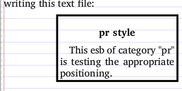 |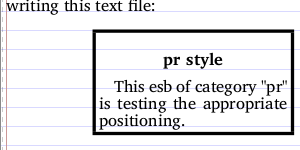 |
| `normal`| 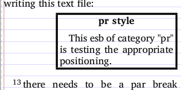 |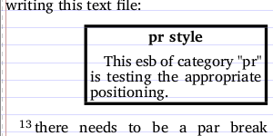 |
| `smart`|  |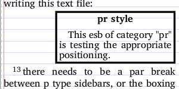 |
| `none`| 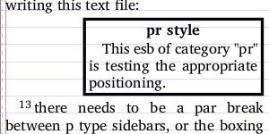 |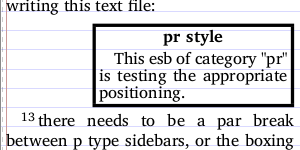 |
| `heading`| 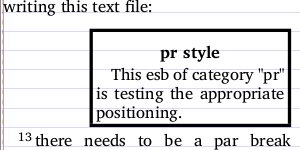 |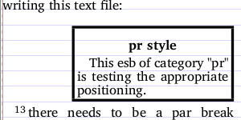 |


The above show that using `smart` reduces the space used on the page by a line in the case where the linespacing is smaller. `none` further affects the space used, by altering the internal layout within the sidebar, but it the issue of lost back-to-back registration means that it is normally unsuitable for long sidebars.

Note: all of the comparisons above used `\XeTeXuseglyphmetrics=1` and a `BorderPadding` of 1. Not making use of glyph-based metrics would have caused a noticable increase in the spacing.

#### Comparison of options for headingsbox 

| Option | Result|
| -- | -- |
|  `normal`|  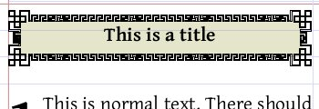 |
|  `smart`|   |
|  `orig` | 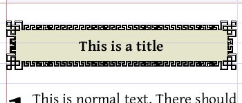 |
|  `none` | 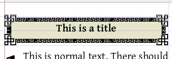 |
|  `heading` |  |

The above were all created using `\s1` with `\SpaceBefore 4` and `\SpaceAfter 4`, and these sidebar settings:
```
\Marker cat:headingsbox|esb
\TextProperties publishable
\SidebarGridding normal
\BorderWidth 4
\BorderPadding 1
\BoxPadding 0
\BorderStyle ornaments
\BorderRef  Han4
\BorderFillColour .5 .5 .5
\BgColor 0.50 0.50 0
```
## Other options (in testing)
`\Breakable option`   **!!!DO NOT USE!!!**

*  Options: T, F, value(0-1)
*  Default: F
*  Incompatible with: Background images.

Should the contents of this box be forced to be on one page or can it be broken? (Not compatible with background images)
With a background colour, the box will be broken into sections and these sections will be added one chunk at a time. Descenders 
may be lost at these joints if a non-transparent background colour is given.

If a value is given, rather than a simple 't', this is the smallest fraction of the pageheight that the sections will be, if 't' is given, the fraction 
will be 0.2 of the page height. If splitting a given chunk of the box is impossible, the algorithm will increase the chunk-size until 
 a break IS possible. 

*NB:* Breakable in out-of-body positions triggers a bug in the page output
mechanism and *things go  horribly wrong* if this option is used.

## Ending the category

`\EndCategory`
Cancels the current category (sets the value to empty). 
Placing `\EndCategory` in a categorysheet file means that until the next \Category,
any stylesheet commands will behave as though in a normal stylesheet, and any category 
options listed above  will apply to \esb boxes without a specified category.

If the stylesheet is loaded by `\categorysheet`, then is used internally,
before and after the categorysheet is read, and is not normally necesary.

The `\stylesheet` command should issues a warning if `\Category` is used without an
`\EndCategory` command towards the end of the file. However, there is no need to place
`\EndCategory` before a `\Category` instruction, as no formal grouping occurs.

The `\StyleCategory` command assumes that the styling fragments contain neither 
`\Category` nor `\EndCategory` 


