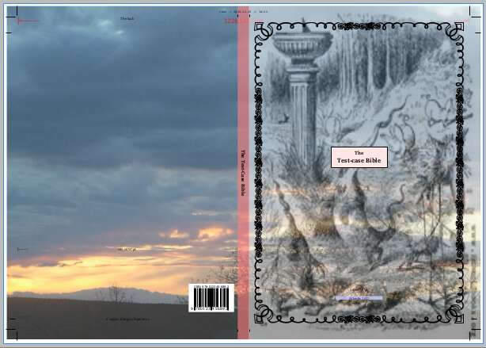
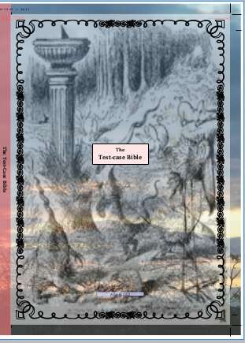
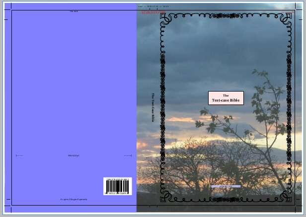
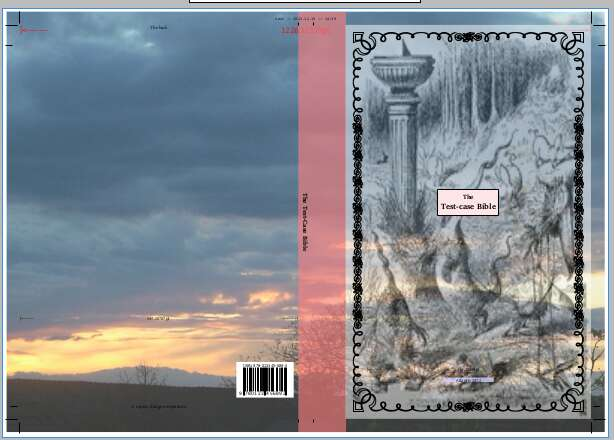
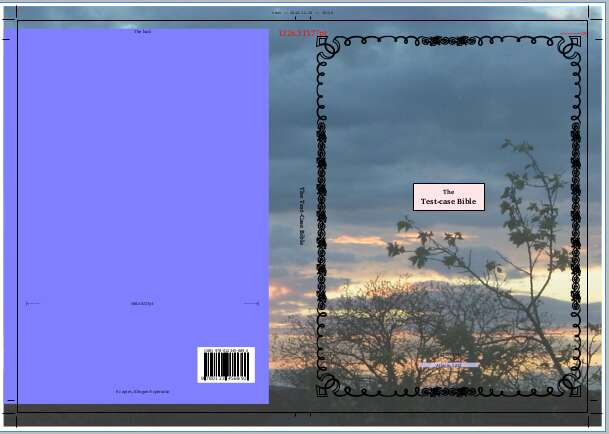

# Covers

## General principles
The cover-generating macro (\\m@kecover) arranges four sidebars to make the cover:
1. The whole cover : `coverwhole`
2. The back cover : `coverback`
3. The spine : `coverspine`
4. The front cover : `coverfront`

The front, spine and back are laid up (on top of the `coverwhole` sidebar) in 
a sequence determined by the boolean `\ifBookOpensLeft`.

The contents are drawn from periphery sections of the same names. If there is no `coverspine` 
periphery or `coverfront` peripery, then the two USFM-3.0 periphery
sections:`spine` and `cover` will be used instead.

An sample cover might have contents such as this (which is cut down from a
test-file): 
```tex
\periph front|coverfront
\zgap|0pt plus 1fill\*
\esb \cat TitleBox\cat*
\mt3 The 
\mt1 Test-case Bible
\esbe
\zgap| 0pt plus 1fill\*
\esb \cat footbox\cat*
\pc \sc Atlantis\sc* 2022
\p
\esbe
\p ~

\periph spine|coverspine
\pc The Test-Case Bible
\p

\periph back|coverback
\pc Test-Case
\zgap| 0pt plus 1fill\*
\esb \cat ISBNbox\cat*
\pc \zISBNbarcode|isbn="978-012345-689-2" height="normal"\*
\esbe
\pc 0 copies, Klingon-Esperanto
\b
```

Each sidebar may have the normal array  normal sidebar foreground and
background images and colours may be defined (but clearly, not all options or 
combinations make sense). Styling is discussed futher down, and this document
ends with a complete stylesheet that could be used to set the above text.

## TeX Parameters

```tex
\expandafter\edef\csname cover-bleed\endcsname{3mm}   % Bleed dimension
\expandafter\edef\csname cover-spine\endcsname{11.23mm}   % Actual spine width = book thickness, endpapers, board thickness, etc.
\expandafter\edef\csname cover-y\endcsname{21cm} % spine/book height 
\expandafter\edef\csname cover-x\endcsname{14.85cm} % Front/back cover
\expandafter\edef\csname cover-back-spinewrap\endcsname{0mm} %  Should the graphic/colour on the spine be given extra space?
\expandafter\edef\csname cover-front-spinewrap\endcsname{0mm} % 
```

The first four TeX values above determine the physical shape and size of the
cover. 
The final two allow the spine colour / image to wrap onto the
front / rear cover as is seen in some editions. 

## Sizing of Background Images
Of particular relevance for covers, as well as the 1x1 (X x Y) scaling factors,
the `\BgImageScale` stylesheet parameter can take a prefix indicating *what*
the image should be scaled to. (Note that these are so-far untested on other
sidebars).

The relevant options are:
* bleed - overflow the page into the cropped area.
* box - the coloured box
* border - the outer edge of the border
* outer - the outermost of the coloured box or the border.
* inner - The area that text could cover (vertically this extends to the inner edge of the border)
* text - The area that text covers (vertically this extends to the height of the text, excluding stretch, and it is probably not useful for covers).

### Examples
```
\BgImageScale inner|1
```
Preserving the orginal aspect ratio, fit the image the the width of the `inner` box:


```
\BgImageScale bleed|1x1
```
Ignoring the original aspect ratio, fit the image to the `bleed` box:



```
\BgImageScale inner|1x1
```
Ignoring the original aspect ratio, fit the image to the `bleed` box:


```
\BgImageScale outer|1x1
```
Ignoring the original aspect ratio, fit the image to the `outer` box:



## Special Formatting 
### Wrapped spine:
The revised Cornilescu Bible, (EDCR 2019, Societatea Biblică Interconfesională
din România,  ISBN 978-606-8279-63-3) has a solid background on the front and
spine that wraps approx 2cm onto the back cover, where a contrasting colour
provides a background for the majority of the rear cover.
To set up a similar cover, the `coverfront`, `coverspine` and `coverback` could have 
appropriate background colours set and the parameter `cover-back-spinewrap`
could be defined to `2cm`.
Alternatively, a large cover image could have the back-page portion of it masked off, 
as in the first figure below. The second shows a semi-transparent red spine wrapped
towards the front.  Notice how the front cover's border and background image are 
shrunk horizontally by this.






### Upper/Lower band: BoxPadding for coverwhole.
Testing demonstrated a strange effect came about from setting the `BoxTPadding` and `BoxBPadding` 
style parameters the `coverwhole`, sidebar, where the covers were pushed off the page. This 
has been embraced as a (probably rarely used) feature: if these padding values are set 
to `>=1pt` then the upper and/or lower bleed is turned off for the other 3 sidebars, 
and background colour for the upper and lower edges will be set by the `coverwhole` sidebar.
Note that nothing from these sidebars should be able to reach into this area.




## Complete style file
The images in this document have almost all been generated using minor
variations on the stylesheet below.
Note the use of the short-hand `\Category` which sets an internal prefix that
is applied to later style definitions. I.e. `\Marker pc` after `\Category coverwhole` 
is actually styling `\Marker cat:coverwhole|pc`

```tex
\Category coverfront
\BorderStyle Vectorian3
\BoxBPadding 30
\BorderWidth 24
\BoxVPadding 45
\BoxHPadding 45
\Alpha 0.6
\BgColour F
%\BgImageLow F
\BgImage SlithyToves.jpg
\BgImageAlpha 0.5
%\BgImageOversize distort
\BorderHPadding -40
\BorderVPadding -40
\BgImageScale inner|x0.8
\Border All

\Category coverback
\Alpha 1
\BgColour T
\BorderStyle double
\BorderFillColour None
\BorderLineWidth 0.5
\BorderPadding -15
%\BoxPadding 20
%\BoxLPadding 5
\BorderWidth 5
\BoxTPadding 2
\BoxHPadding 20
\BoxBPadding 10
\Border None 

\Category coverwhole
%\SpaceBefore 10
%\BoxLPadding 30
%\BorderTPadding -30
\BgImage Background.jpg
\BgImageScale bleed|1.0x1
\BorderWidth 1.0
\BgColour F
\BgImageAlpha 0.8
\BoxVPadding 0
\Border None
\Border All 

\Marker pc
\Color xff0000
\FontSize 24

\Marker p
\Color xff0000

\Category coverspine
\Border None
\Alpha 0.6
\BgColour F
\Rotation r

\Marker pc
\FontSize 16
\Bold

\Category TitleBox
\Position hc
\Scale 0.3
\SpaceBefore 10
\SpaceAfter 20
\BgColour 1.0 0.9 0.9
\Border All
\BoxPadding 0
\BoxBPadding 10
\Alpha 1

\Category ISBNbox
\Position hr
\SpaceBefore 100
\SpaceAfter 0
\Border None
\BorderWidth 0
\BgColour 1 1 1
\BoxHPadding 5
\BoxVPadding 5
\BorderRPadding 10
\Scale 0.7
\Alpha 1

\Category footbox
\Position h
\SpaceBefore 10
\SpaceAfter 10
\Scale 0.25
%\Border All
\BgColour 0.8 0.8 1
%\BoxHPadding 0
%\BoxVPadding 0
%\BorderPadding 1
%\Scale 0.3
\Alpha 0.8

```


