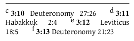
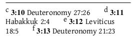
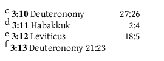
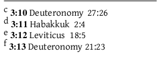

# Diglot options and settings

## General overview
The diglot options allow for typesetting two versions in parallel, aligned by verse or paragraph. If that makes no sense, have a look at the samaple below, where the right hand column's paragraphs are one line shorter, but still the paragraphs in the two columns line up. To do this the two peices of text require an extra pre-processing step and then a number of extra configuration controls to make things really beautiful.
The preprocessing step picks `pairs' of things that ought to be aligned, and puts these pairs into what we can call a *chunk*. These pairs might be verses, paragraphs at the same  place, and so on. 
At the moment this step is done by a perl program (or by hand for small sections of text). Efforts will eventually be underway to make a python version, which would integrate better with the rest of ptxprint.


## The structure of a diglot-friendly usfm file.
The preprocessing step "shuffles" the two files together, interspersing them with instructions to switch sides. (For as-yet-uncertain reasons, these instructions seem to work much better if  preceeded by \p). There are four instructions:  ```\lefttext``` ```\righttext``` ```\nolefttext``` ```\norighttext```. The ```\nolefttext``` specifies that the text that follows ought to begin below any text remaining in the the left-hand column, and start a chunk that will not have any corresponding left-hand text.   A sample of the  file that produced the above image is given below. 
```
\lefttext
\s The birth of diglot 
\p
\norighttext
\p
\v 4 David took ptxplus and tweaked it in various places and so diglot came into being, and it lived in dark obscurity for many years, sometimes crafting text, sometimes creating strange things.
\p
\righttext
\p
\v 4 And David took ptxplus and did bend it in diverse places to make diglot.  Diglot dwelt in darkness and created beauty or disaster depending upon many factors.
```


## Diglot-specific configuration items to go in custom stylesheets:

Any ```\Marker```  can (theortically) be generic (e.g. 'p') or apply to a single column only ('pL' or 'pR' for left and right versions of 'p').

Background: when the code looks up a parameter for style 'p' it first looks up the parameter for 'pL' if in the left column or 'pR' if its in the right column, and then if it can't find one it looks up the unadorned 'p' properties.

  Example: A user who wants to confuse us has:
```
\Marker p
\Fontsize 11
\FontName Gentium

\Marker pR
\Fontsize 12

\Marker pL
\FontName DoulosSIL
```
The left column will use:
	DoulosSIL (column specific) at 11pt (default), 
and the right column will use:
	Gentium (default) at 12pt (column specific).


## Configuration items to go in foo-setup.tex (or main .tex file)

###True/false options

- ```\diglottrue```
If there is diglot material this **must be set true** (i.e. ```\diglottrue```), **before** the style sheet is loaded (default: ```\diglotfalse```).

- ```\diglotSepNotestrue```
If the footnotes from the 2 languages should be split (true) or merged together (false) (default: ```\diglotSepNotestrue```). Merging footnotes is almost certainly not a wise choice if both texts have footnotes, but if only one side has notes then it probably makes a lot of sense. The exact order of the footnotes is probably complicated and may even be unpredictable.

- ```\diglotBalNotesfalse```
If a left column footnote steals space from the right column also, and vise-versa (default: ```\diglotBalNotesfalse```). If this is a good idea or not probably depends on a lot of factors. 

- ```\useLeftMarkstrue```
- ```\useRightMarkstrue```
When you've got just one page and two texts, and one text goes until verse 15  and the other manages to fit verse 16 and 17 on as well, what do you put in the header 15 or 17?
 Intuitively, we'd probably expect the first 'mark'  [i.e. chapter:verse] on the page to be from the left-hand column, and the last  from the right, but this possibly becomes confused with ```\nolefttext```, and even with short sections where the first verse set is actually on the right.  These two options control whether marks from the left-hand column and right-hand column are used in the standard heading macros (```\rangeref```, ```\firstref``` and ```\lastref```). Setting both to true might *normally* work, but sometimes it won't; it is best to pick one side to populate the headers, or use the side-specific variants below. 

- ```\LeftMarkstrue```
This used to be the only control that affected what went into the header (defaulting to true). It is now a short-hand for \useLeftMarkstrue\useRightMarksfalse.
 

- ```\VisTracefalse``` 
A debugging option for really sticky problems; see end of this document.

### Header macros
- ```\rangerefL``` and ```\rangerefR``` (and their companions ```\firstrefL,R``` and ```\lastrefL,R```) have now been defined, which display the book/chapter/verse ranges on a given column only. The appropriate font will be selected from the stylesheet(s) (```\Marker h```, ```hL``` and ```hR```, as above).

### Page layout options
- ```\def\ColumnGutterFactor{15}``` 
Gutter between the 2 cols, (measured in ```\FontSizeUnit```s), just like in two column mode.

-  ```\def\DiglotLeftFraction{0.5}``` 
Fraction of the space is used by the left column

-  ```\def\DiglotRightFraction{0.5}``` 
Fraction of the space is used by the right column 

Hopefully, the  above fractional controls (and the font-sizes from they style sheet) should enable even the most widely different translation styles and languages to balance in an overall pleasing way, without huge gaps under every chunk on one column.


### Hooks
Like the markers, hooks can be made to apply to left or right columns. e.g.:
```
\sethook{start}{q1L}{\hangversenumber}
```
will apply the ```\hangversenumber``` only for the left column.

### Setting hyphenation languages

- ```\def\languageL{english}```
  Left column is in english. (Requires that the language's hypenation patterns have been loaded).

- ```\def\languageR{nohyphen}``` 
  Right column should not be hypenated


### Mixing diglot and monoglot text

The font-switching code requires that ```\diglottrue``` is specified before 
any style sheets are loaded. 
If ```\diglottrue``` has been specified, then any usfm code text is set in the left column until a ```\righttext``` is encountered. 
If ```\diglotfalse``` is in force, then the non-diglot parameters will take effect, e.g.:
```
\TitleColumns=1 
\IntroColumns=1  
\BodyColumns=2
```
A .usfm file cannot (easily) redefine those values (as numbers are not treated as numbers within the .usfm code, otherwise ```\s2``` would be treated by XeTeX as ```\s``` followed by 
parameter ```2```. However, ```\singlecolumn```, ```\doublecolumns``` and ```\diglotcolumns``` will probably work. These are internal commands and their use hasn't been tested recently. It may be 
necesary to specify \diglotfalse before switching.


### Other settings
- ```\Alternative```
  The PDF bookmarks are produced (by default) with a ```/``` separating the chapter name. The slash is actually produced by ```\Alternative```, in case 
slash not the correct symbol to use. 

## Easy solutions to common problems

### Avoiding mismatched titles
Sometimes the title or section headers can be misaligned. Seen by, for instance a book title being out of place by quarter of a line.  This is because the main program adjusts the title spacing in ways that the diglot code cannot discover (yet?). It is most noticable in book titles, but can also occur in multi-line section headings. The cause is normally that one side contains a taller letter than the other side, or a letter that descends below the line further. 

If that's the case, and say one side has no descenders and the other contains a 'p', then the nasty work-around is to add ```\dstrut p``` to the side which has no 'p'. ```\dstrut```  swallows the letter that comes after it and replaces it with a non-visible object of zero width, exactly as high and deep as the letter it destroyed. 

### My cross-references look ugly
With very small columns, and long booknames, you can end up with things looking like this:


Or with left justification:



We could tell XeTeX that *anything* is better than line breaks between the origin reference and the text. This nasty bit of code gets rid of the gap and then puts it back, without allowing line breaking:
```
\sethook{end}{xo}{\dimen0=\lastskip\unskip\penalty 10000\hskip \dimen0  minus 0.5\dimen0\penalty 10000}
```

With full justification, you get this:


which looks *far worse*, so you really want left justification:

Note that this *looks* like one-reference per paragraph, but it's not. If the there were shorter words,  a long list of references from one book or the booknames are shortened, then the text will suddenly form paragraphs. This may be just what you want, or it may not be.

### XeTeX crashes saying:
```
! Missing number, treated as zero.
<to be read again> 
                   \note-fR 
\s@tn@tep@r@ms ...count \csname note-#1\endcsname 
                                                  =\ifp@ranotes 500 \else 10...

\\...Notes \s@tn@tep@r@ms {#1}\s@tn@tep@r@ms {#1R}
                                                  \else \s@tn@tep@r@ms {#1}\...
<inserted text> \\{f}
                     \\{fe}\\{x}
\initn@testyles ...@tn@tep@rams \the \n@tecl@sses 
                                                  
\ptxfile ...lR {} \initp@rastyles \initn@testyles 
                                                  \openadjlist "\the \AdjLis...
``` 
This is a very characteristic error message, and can be recognised from the first three lines (or the last two). A diglot ```.usfm``` file is being processed, and XeTeX  is trying to set up a diglot version of a footnote,  (in this case ```\note-fR```, see the third line, but it might be some other ``\note-```, like xR).
However because the ```\diglottrue``` command wasn't given when the footnote ```\f``` was defined, there is no ```\note-fR```. Solution: ```\diglottrue``` **must**  be in force when style sheets are loaded if diglot typesetting is to be used.


## Debugging commands (here be dragons)

These diglot-specific  commands are only necessary when something's going horribly wrong. They produce a lot of additional output (even more in the log file) and might help to solve mysterious problems. 

- ```\let\TRACEdiglot=\doTRACEdiglot``` 
Generate hundreds of (numbered) lines of debugging information per chunk.

- ```\VisTracetrue``` 
A debugging option to help decipher the information given above. Any time a chunk is added to a page, also put the current debugging number in there.

- ```\diglotDbgJoinboxes=132```
At various points in the process, boxes (see later) get joined together, by a macro called ```\joinboxes```. This is a debugging option to help check that what's happening there is what ought to be happening.  XeTeX has a debugging command ```\showbox```, which stops processing and writes information about a given box (in the case here, a box is the stack of lines separated by spaceing).  This command fires the ```\showbox```  command if the number given is the current debug message number when joinboxes is called.  If the number is set to 0, and the command ```\let\TRACEdiglot=\doTRACEdiglot``` has not been given, then every single call to joinboxes will result in a ```\showbox```.  **You almost certainly don't want to do this!** 

