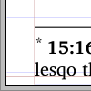
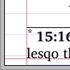
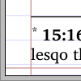
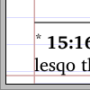
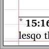

# Enhanced control of footnotes
## Note placement
There are some flags that control the exact placement of paragraphed footnotes relative to other page elements. This is the beginning of an attempt to document them.

|  | gr, !gl | gr, gl  | !gr, !gl | !gr,gl |
|--|--|--|--|--|
| kdp |    |   |    |   |
| !kdp |    |   |    |   |

Key to the above table:

|Abbreviation | Option|
|--|--|
| kdp | `\parnoteskilldepthtrue` - Remove depth after paragraphed notes|
| !kdp | `\parnoteskilldepthfalse` |
| gr	| `\parnotesruletopskiptrue`  - Use grid (linespacing) not font/glyph height at rule|
| !gr	| `\parnotesruletopskipfalse`  |
| gl	| `\FootNoteGlyphMetricstrue` - Use glyph height not font height in footnotes |
| !gl | `\FootNoteGlyphMetricsfalse`| 

The defaults (!gl, !gr, !kdp) are selected to correspond to the old-style footnotes, however as can be seen in the images, they can result in the largest possible amount of whitespace around the notes, as they obey the full ascent and descent of the font, which can be excessive on some fonts.

For the most consistent results when a variety of fonts is in use, (for example in a study bible where notes use different categories which may affect the fonts from one page to another), it is highly recommended to remove all font-based changes: Use the grid (linespacing) at the rule, and remove depth after paragraphed notes.

If depth is not removed, then it is normally a good idea to avoid the use of glyph metrics, otherwise the footnote moves up and down on the page depending whether the last line of the note has descenders or not.

## Breaking footnotes across pages
In certain circumstances it is useful to be able to have a footnote split across two pages, in order to fill a page optimally.  Mainly this is of use in study Bibles, however any scripture with occasional long notes might  also benefit.

TeX includes an internal mechanism of  footnote breaking, which relies on page-contribution calculations, which are available at the time that the page-forming, (and even line-breaking) algorithm is working. Unfortunately balanced two-column pages need to second-gues those calculations, and nor does it mesh well with paragraphed footnotes.
Thus,  normally this mechanism is  effectively disabled (by the default code deliberately underestimating the page-contribution of footnotes).

An alternative, (possibly *additional*) mechanism is to  "**shave**" some lines from the bottom of the footnote box, having constraints so they belong to the last footnote. There are restrictions in this, and it is presently best considered as experimental and likely to change in future versions. 
 
### Current limitations on shaved notes at time of writing:
1. Only the last footnote class appearing on the page can be shaved.
2. Only paragraphed notes can get shaved
3. As the current mechanism is to try the longest page-contents *first* and then try to shave footnotes so that they fit, breaking a footnote is not a last resort, and no amount of tweaking penalties can make it so.
4. Diglot use is untested.

### Controls
* `\lastnoteinterlinepenalty`,  `\lastnoteparpenalty,` `\lastnoteclubpenalty` and `\lastnotewidowpenalty` are `\count` type variables that control the possible break-points in a footnote. (Assigning a penalty of 10000 or more indicated 'impossible'). 
* `\def\NoteShaveShortest{2}` How many lines long must the last note be before any attempt is made to shave it? (The value is approximate, as we are discussing paragraphed footnotes)
* `\def\NoteShaveMin{1}` If a footnote is being shaved, what is the minimum number of lines to move?
* `\def\NoteShaveStay{1}` If a footnote is being shaved,  how many lines of (all) notes must remain on the page? Note that it does not consider how many lines of text the note has, but how many lines of footnotes there must be on the page for a shave to be considered acceptable.