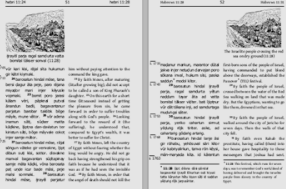

### Known issues and work-arounds

## Image-pairs in diglot  not appearing  on the same page 

When setting 2 pictures next to each other, i.e. a pair of images, the user may observe a result 
like in the above screenshot, where instead of being next to each other, the
images go on different pages.  (The above screenshot comes from a debugging
run which uses the same image twice. It also has extra marks on the margins. 
Those marks, while not in focus, are helpful to explain what's happening). 

The piclist for the image anchors the text to the last verse on the page. 

In diglot processing, the page is arranged into chunks with a chunk containing
text from the left and right columns.  The marks in the left-hand margin show
where these chunks get stuck together to form the page. 

The computer is less creative than any human. It has only been told to add up
how much new material it is adding to the page and make sure it doesn't
go off the end (this works fine most of the time!).  

When the processing the final left-hand chunk the computer reads the image,
caclulates how many lines of space it takes up, and shortens its concept of how much 
space is available; the left column is quickly full, so it leaves any other
lines it might have been considering adding for the next page.

It then applies the same proces on the right, knowing it has space for 8 lines of text.
When it gets to the 'include this image' instruction, there is no space for the
image in these 8 lines that it knows it has available.  It therefore decides it must
put the image onto the next page. This caclulation happens as an intrinsic
part of XeTeX, and we have no real control of this. 
It is also **entirely correct** for all image postitions except top-right.

All we can eventually do is be cleverer about telling XeTeX how much space an
image takes, based on where the user has said it should go.

For the moment, the work-around is to ensure that when the picture is included 
there IS enough space for it to still fit on the page. I.e. move the anchor
**for both pictures** to a verse that is in the upper portion of the page.
(If only the right image is moved earlier, the same 'there is space for only 8
lines of text, the image doesn't fit' logic will shift the left image onto the
next page).

There will then be time for the code to correctly recalculate how much space
the pair of images actually take from the page, without XeTeX needing to make
snap-decisions.

